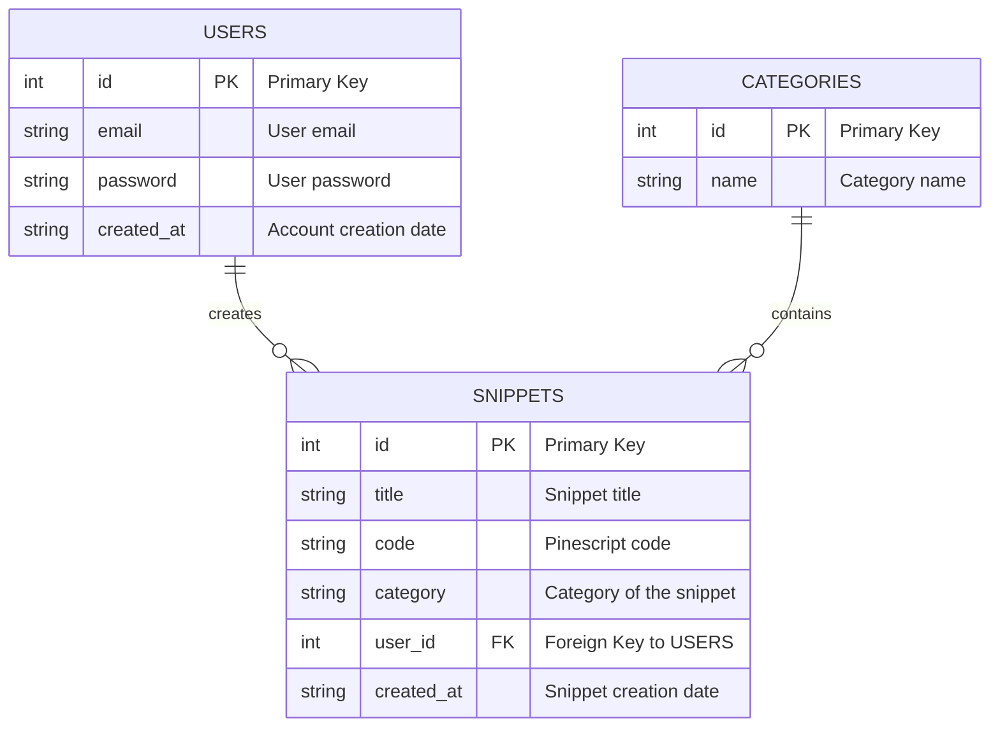

# Database Entity Relationship Diagram

```mermaid
erDiagram
    USERS {
        int id PK "Primary Key"
        string email "User email"
        string password "User password"
        string created_at "Account creation date"
    }

    SNIPPETS {
        int id PK "Primary Key"
        string title "Snippet title"
        string code "Pinescript code"
        string category "Category of the snippet"
        int user_id FK "Foreign Key to USERS"
        string created_at "Snippet creation date"
    }

    CATEGORIES {
        int id PK "Primary Key"
        string name "Category name"
    }

    USERS ||--o{ SNIPPETS : "creates"
    CATEGORIES ||--o{ SNIPPETS : "contains"
```
